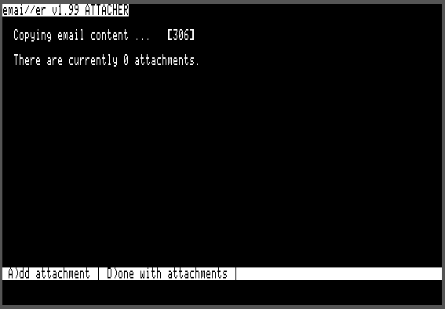
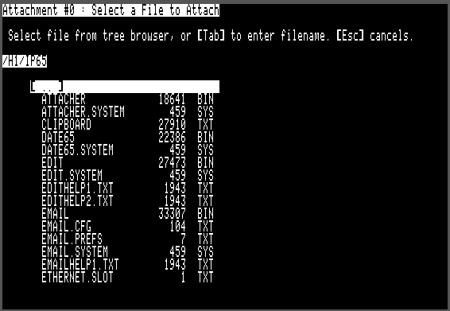
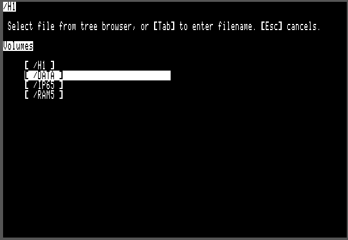
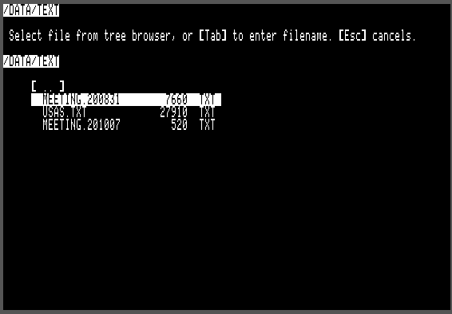
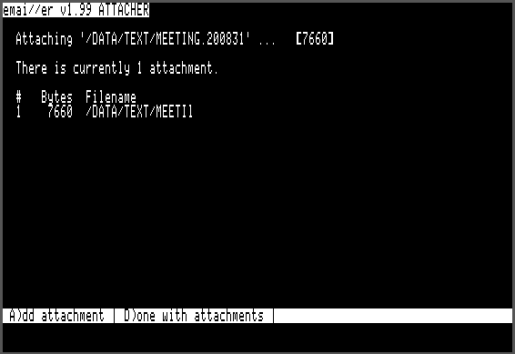
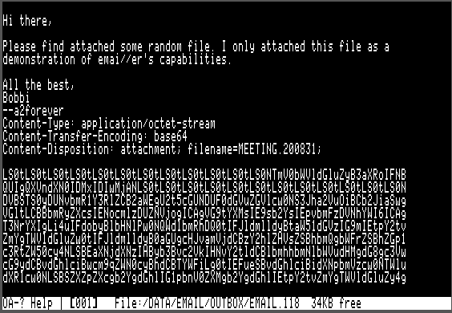

# Apple II Email and Usenet News Suite

[Back to Main emai//er Docs](README.md#detailed-documentation-for-email-functions)

## `ATTACHER.SYSTEM`

*Automatically invoked when exiting `EDIT.SYSTEM` when using the `W` (write email), `F` (forward email) or `R` (reply) commands in `EMAIL.SYSTEM`*

`ATTACHER.SYSTEM` is used for attaching files to outgoing email messages.  This program is started automatically by `EDIT.SYSTEM` and is not normally invoked directly.

Here is how it looks when it first starts up - there are no attachments yet:

Using the file selector to choose an attachment:

Navigate up the to the top level 'Volumes' by repeatedly selecting the `..` entry and hitting `Return`.

The navigate down to the directory of interest, select the file to attach and hit `Return`.

Now `ATTACHER.SYSTEM` shows there is a file attached.

When `EDIT.SYSTEM` invokes `ATTACHER.SYSTEM`, the following operations occur:

 - The outgoing email message is loaded from `OUTBOX` and copied to a temporary file. While copying, additional email headers are appended to indicate that this is a MIME multi-part message.
 - A `plain/text` MIME section header is added to the email body (which becomes the first section in the multi-part MIME document.)
 - `ATTACHER.SYSTEM` loops until the user says they are done adding attachments:
   - Display the current number of attached files. Initially this shows `There are currently 0 attachments`.
   - Display a list of the files that have been attached so far.
   - Prompt: `A)dd attachment | D)one with attachments`.
   - If the user chooses 'D' then we are done adding attachments. Exit the loop.
   - If the user chooses 'A' then a file selector is shown, allowing the user to choose the file to attach. Navigate to the desired directory and select the file to be attached. Alternatively, you can hit the `Tab` key and type in the absolute or relative path to the file to be attached.
   - The selected file is loaded from disk and encoded using the Base64 algorithm. A MIME section is created in the outgoing email and the Base64-encoded file data is appended.
 - `ATTACHER.SYSTEM` will terminate the MIME document, erase the original email file from `OUTBOX` and rename the temporary file to replace the original.
 - `ATTACHER.SYSTEM` will reload `EMAIL.SYSTEM` once it is done.

Here is how the Base64-encoded email attachment is encoded:

[Back to Main emai//er Docs](README.md#detailed-documentation-for-email-functions)

