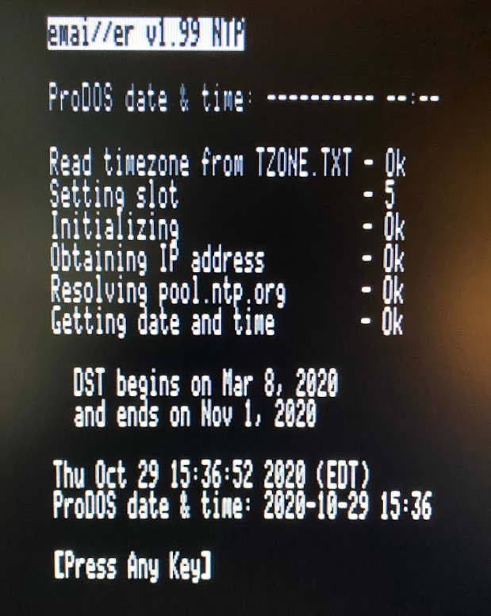

# Apple II Email and Usenet News Suite

<p align="center"></p>

[Back to Main emai//er Docs](README-emailler.md#detailed-documentation-for-email-functions)

## `DATE65.SYSTEM`

*Run using `Open Apple`-`D` in `EMAIL.SYSTEM`*

<p align="center"></p>

Unlike the other programs making up the Emai//er suite, `DATE65.SYSTEM` is an enhanced version of an existing IP65 program, rather than a completly new development.

`DATE65.SYSTEM` has been integrated into the Emai//er suite in order to provide a convenient way to set the ProDOS date and time for Apple //e systems which do not have a real time clock.  Apple IIgs machines have a built in system clock, so `DATE65.SYSTEM` is not required.

`DATE65.SYSTEM` has also been enhanced to handle timezones and Daylight Saving Time (DST) rules, rather than simply obtaining the time in Coordinated Universal Time (UTC).  The timezone settings are configurable to suit your local timezone using a simple configuration file `TZONE.TXT`.

The supplied `TZONE.TXT` file is for Eastern Standard Time / Eastern Daylight Time, and looks like this:

```
-18000,EST
-14400,EDT
```

The first line is for Standard Time (ie: winter time).  This has an offset of -18000 seconds (5 hours) relative to UTC and has the symbolic name 'EST'.  The second line defines Daylight Saving Time (ie: summer time), with an offset of -14400 seconds (4 hours) and name 'EDT'.

The Daylight Saving Time rules are hard coded in `date65.c` using the current North American rules.  The code will have to edited if you wish to implement Daylight Saving Time rules for any other area of the world.

When `DATE65.SYSTEM` is run (either directly or using the `Open Apple`-`D` shortcut in `EMAIL.SYSTEM`) it will:

 - Show the current ProDOS date and time (or `---------- --:--` if it is not set.)
 - Obtain the current UTC time using NTP server `pool.ntp.org`
 - Display the dates when DST starts and ends in the current year.
 - Examine today's date to determine if Daylight Saving Time is in effect or not.
 - Convert the time to the correct local time.
 - Show the new ProDOS date and time.
 - Store the date and time in the reserved memory locations ProDOS uses for this information.

Note that if the system has a real-time clock (RTC) the date and time information obtained from `DATE65.SYSTEM` will be overwritten.  Otherwise the date and time information remain constant until the next time `DATE65.SYSTEM` is run.

[Back to Main emai//er Docs](README-emailler.md#detailed-documentation-for-email-functions)

