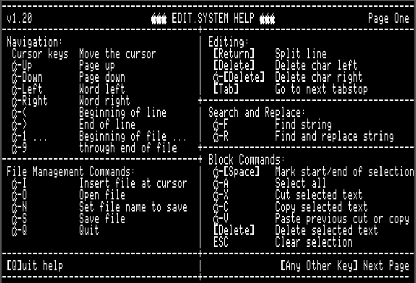
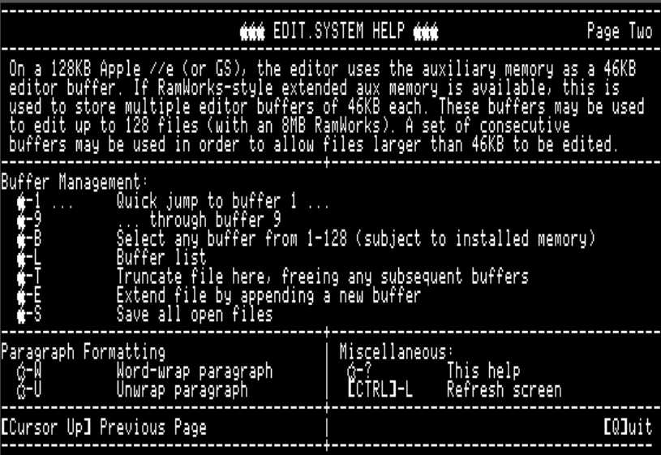

# Apple II Email and Usenet News Suite

[Back to Main emai//er Docs](README-emailler.md#detailed-documentation-for-email-functions)

## `EDIT.SYSTEM`

*Automatically invoked when using W)rite, F)orward or R)eply in `EMAIL.SYSTEM`*

*Run manually using `Open Apple`-`E` in `EMAIL.SYSTEM`*

`EDIT.SYSTEM` is a simple full-screen editor.  It uses Apple //e auxiliary memory to store the text buffer, allowing files up to 46KB to be edited.  The command keys are similar to the popular AppleWorks word processor.

If RamWorks-style memory expansion is available, `EDIT.SYSTEM` can use it as additional editor buffers.  For each 64KB bank of RamWorks expansion, an additional 46KB buffer will be allocated.  With an 8MB RamWorks card, 128 buffers are available.  `EDIT.SYSTEM` is able to support editing of large files (>46KB) by splitting them across more than one buffer.

The help screens are accessed using `Open Apple`-`?` and summarize all the keyboard bindings.

### Navigation Commands

 - Cursor `Up`, `Down`, `Left, `Right` - move the cursor up, down, left, right
 - `Open Apple`-`Up` - Page up
 - `Open Apple`-`Down` - Page down
 - `Open Apple`-`Left` - Word left
 - `Open Apple`-`Right` - Word right
 - `Open Apple`-`<` - Beginning of line (alternate `Ctrl`-`A`)
 - `Open Apple`-`>` - Beginning of line (alternate `Ctrl`-`E`)
 - `Open Apple`-`1` - Go to beginning of file
 - `Open Apple`-`2` -
 - `Open Apple`-`3` -
 - `Open Apple`-`4` -
 - `Open Apple`-`5` - Go to middle of file
 - `Open Apple`-`6` -
 - `Open Apple`-`7` -
 - `Open Apple`-`8` -
 - `Open Apple`-`9` - Go to end of file

### File Management Commands

 - `Open Apple`-`I` - Insert file at cursor
 - `Open Apple`-`O` - Open file
 - `Open Apple`-`N` - Set file name for next save
 - `Open Apple`-`S` - Save file
 - `Open Apple`-`Q` - Quit to `EMAIL.SYSTEM` if invoked from there, otherwise quits directly to ProDOS.

### Simple Text Editing

`EDIT.SYSTEM` is not a modal editor - it is always in insert mode and there is no overtype mode. All printable characters on the keyboard insert themselves.

 - `Return` - Split line
 - `Delete` - Delete character left
 - `Open Apple`-`Delete` - Delete character right (alternate `Ctrl`-`D`)
 - `Tab` - Advance to next tabstop. Tabs are hard coded every eight columns. `EDIT.SYSTEM` does not insert tab characters into the file, but instead inserts the correct number of spaces to advance to the next tab position.

### Search and Replace

 - `Open Apple`-`F` - Find instances of a string
 - `Open Apple`-`R` - Find instances of a string and substitute a replacement

### Block Commands

 - `Open Apple`-`Space` - Begin selection mark here
 - `Open Apple`-`A` - Select all
 - `Open Apple`-`X` - Cut the selected region from the mark to the cursor
 - `Open Apple`-`C` - Copy the selected region from the mark to the cursor
 - `Open Apple`-`V` - Paste the cut buffer at the cursor
 - `Delete`         - Delete the selected region from the mark to the cursor
 - `Esc`            - Clear selection
 - `Open Apple`-`Z` - Undo last block operation

### Paragraph Formatting

 - `Open Apple`-`W` - Word-wrap paragraph
 - `Open Apple`-`U` - Unwrap word-wrapped paragraph

### Multiple Buffers

 - `Closed Apple`-`1` - Quick jump to buffer #1
 - `Closed Apple`-`2` - Quick jump to buffer #2
 - `Closed Apple`-`3` - Quick jump to buffer #3
 - `Closed Apple`-`4` - Quick jump to buffer #4
 - `Closed Apple`-`5` - Quick jump to buffer #5
 - `Closed Apple`-`6` - Quick jump to buffer #6
 - `Closed Apple`-`7` - Quick jump to buffer #7
 - `Closed Apple`-`8` - Quick jump to buffer #8
 - `Closed Apple`-`9` - Quick jump to buffer #9
 - `Closed Apple`-`B` - Select buffer by number (buffers 1-128)
 - `Closed Apple`-`T` - Truncate file here, freeing any subsequent buffers
 - `Closed Apple`-`E` - Extend file by appending a new buffer
 - `Closed Apple`-`S` - Save all open files
 - `Closed Apple`-`+` - Go to next buffer
 - `Closed Apple`-`-` - Go to previous buffer
 - `Closed Apple`-`L` - List of active buffers and files

### Large File Support

### Miscellaneous

 - `Open Apple`-`?` - Help
 - `Ctrl`-`L` - Redraw screen
 - `Esc` - Cancel file selection or search/replace operations

[Back to Main emai//er Docs](README-emailler.md#detailed-documentation-for-email-functions)

