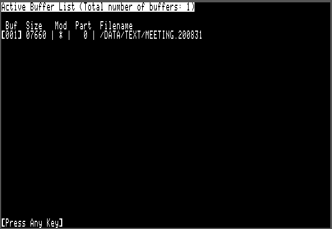
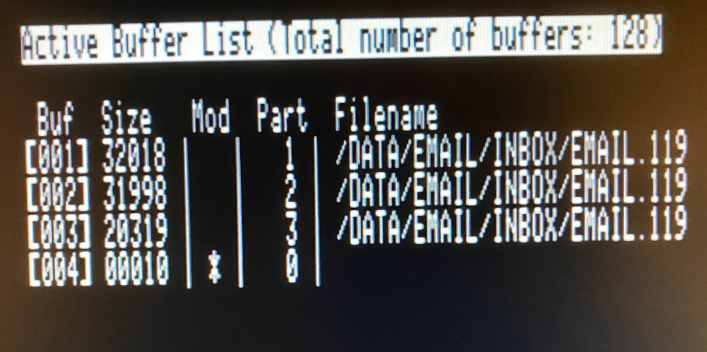

# Apple II Email and Usenet News Suite

[Back to Main emai//er Docs](README-emailler.md#detailed-documentation-for-email-functions)

## `EDIT.SYSTEM`

*Automatically invoked when using W)rite, F)orward or R)eply in `EMAIL.SYSTEM`*

*Run manually using `Open Apple`-`E` in `EMAIL.SYSTEM`*

`EDIT.SYSTEM` is a simple full-screen editor.  It uses Apple //e auxiliary memory to store the text buffer, allowing files up to 46KB to be edited.  The command keys are similar to the popular AppleWorks word processor.

If RamWorks-style memory expansion is available, `EDIT.SYSTEM` can use it as additional editor buffers.  For each 64KB bank of RamWorks expansion, an additional 46KB buffer will be allocated.  With an 8MB RamWorks card, 128 buffers are available.  `EDIT.SYSTEM` is able to support editing of large files (>46KB) by splitting them across more than one buffer.

The help screens are accessed using `Open Apple`-`?` and summarize all the keyboard bindings.

Second page of help:

### Navigation Commands

 - Cursor `Up`, `Down`, `Left, `Right` - move the cursor up, down, left, right
 - `Open Apple`-`Up` - Page up
 - `Open Apple`-`Down` - Page down
 - `Open Apple`-`Left` - Word left
 - `Open Apple`-`Right` - Word right
 - `Open Apple`-`<` - Beginning of line (alternate `Ctrl`-`A`)
 - `Open Apple`-`>` - Beginning of line (alternate `Ctrl`-`E`)
 - `Open Apple`-`1` - Go to beginning of file
 - `Open Apple`-`2` -
 - `Open Apple`-`3` -
 - `Open Apple`-`4` -
 - `Open Apple`-`5` - Go to middle of file
 - `Open Apple`-`6` -
 - `Open Apple`-`7` -
 - `Open Apple`-`8` -
 - `Open Apple`-`9` - Go to end of file

### File Management Commands

 - `Open Apple`-`I` - Insert file at cursor
 - `Open Apple`-`O` - Open file
 - `Open Apple`-`N` - Set file name for next save
 - `Open Apple`-`S` - Save file
 - `Open Apple`-`Q` - If the editor invoked from `EMAIL.SYSTEM` then launch that program again, otherwise quit directly to ProDOS.

### Simple Text Editing

`EDIT.SYSTEM` is not a modal editor - it is always in insert mode and there is no overtype mode. All printable characters on the keyboard insert themselves.

 - `Return` - Split line
 - `Delete` - Delete character left
 - `Open Apple`-`Delete` - Delete character right (alternate `Ctrl`-`D`)
 - `Tab` - Advance to next tabstop. Tabs are hard coded every eight columns. `EDIT.SYSTEM` does not insert tab characters into the file, but instead inserts the correct number of spaces to advance to the next tab position.

### Search and Replace

 - `Open Apple`-`F` - Find instances of a string
 - `Open Apple`-`R` - Find instances of a string and substitute a replacement

### Block Commands

Block commands generally work in a similar way to modern Windows/Mac programs (only using `Open Apple` instead of `Ctrl` as the modifier.) Begin a selection with `Open Apple`-`Space` and then use any of the navigation keys to move to the other end of the selection.

 - `Open Apple`-`Space` - Begin selection mark here
 - `Open Apple`-`A` - Select all
 - `Open Apple`-`X` - Cut the selected region from the mark to the cursor
 - `Open Apple`-`C` - Copy the selected region from the mark to the cursor
 - `Open Apple`-`V` - Paste the cut buffer at the cursor
 - `Delete`         - Delete the selected region from the mark to the cursor
 - `Esc`            - Clear selection
 - `Open Apple`-`Z` - Undo last block operation

### Paragraph Formatting

`EDIT.SYSTEM` does not perform word wrapping as you type, but instead offers a pair of functions for wrapping and unwrapping paragraphs. Using these two functions, you can flip backwards and forwards between wrapped and unwrapped formats.

 - `Open Apple`-`W` - Word-wrap from beginning of paragraph up to the cursor position. The lines are broken at or before column 80.
 - `Open Apple`-`U` - Unwrap word-wrapped paragraph up to the cursor position. This function removes single carriage returns within the current paragraph.

### Multiple Buffers

On a 128KB Apple //e (or a IIgs) `EDIT.SYSTEM` uses the auxiliary RAM bank to provide a single 46KB editor buffer. If RamWorks type extended auxiliary memory is available, then `EDIT.SYSTEM` will use the additional banks of auxiliary memory to provide additional editor buffers, each of 46KB size.

With an 8MB RamWorks card, 128 editor buffers are available, numbered from 1 to 128. A number of commands are provided for interacting with multiple buffers. These commands all use the `Closed Apple` modifier.

 - `Closed Apple`-`1` - Quick jump to buffer #1
 - `Closed Apple`-`2` - Quick jump to buffer #2
 - `Closed Apple`-`3` - Quick jump to buffer #3
 - `Closed Apple`-`4` - Quick jump to buffer #4
 - `Closed Apple`-`5` - Quick jump to buffer #5
 - `Closed Apple`-`6` - Quick jump to buffer #6
 - `Closed Apple`-`7` - Quick jump to buffer #7
 - `Closed Apple`-`8` - Quick jump to buffer #8
 - `Closed Apple`-`9` - Quick jump to buffer #9
 - `Closed Apple`-`B` - Select buffer by number (buffers 1-128)
 - `Closed Apple`-`S` - Save all open files
 - `Closed Apple`-`+` - Go to next buffer
 - `Closed Apple`-`-` - Go to previous buffer
 - `Closed Apple`-`L` - List of active buffers and files

`Closed Apple`-`1` through `Closed Apple`-`9` allows rapid flipping through the first nine buffers. `Closed Apple`-`+` and `Closed Apple`-`-` are also convenient for quickly accessing the next buffer or the previous buffer. Buffers may also be accessed directly by number using the `Closed Apple`-`B` command.

`Closed Apple`-`L` shows a status display of all of the editor buffers, showing the file loaded into each buffer:

The following information is shown in the buffer list:

 - Buffer number (001 to 128)
 - Size - the number of bytes used in that buffer
 - Mod - an asterisk is shown if the buffer has been modified and has not yet been saved
 - Part - this is zero for single part files - see the following section for more information
 - Filename - the ProDOS filename for the buffer, or blank if the buffer has not been assigned a filename (ie: it is a scratch buffer)

With an 8MB RamWorks card up to 128 files, each of size up to 46KB, may be edited simultaneously.

### Large File Support

When RamWorks memory is available, `EDIT.SYSTEM` is also able to utilize it to edit files larger than a single 46KB bank. It does this by loading a large file into sequential memory banks, leaving around 14KB of free space in each buffer to allow for editing. Only two additional commands are required for managing multi bank large files:

 - `Closed Apple`-`T` - Truncate file here, freeing any subsequent buffers
 - `Closed Apple`-`E` - Extend file by appending a new buffer

#### Editing an Existing Large File

Suppose we wish to edit a file which is 100KB in size. This will require three or four buffers, which must be contiguously numbered. When loading a large file using the `Open Apple`-`O` command, `EDIT.SYSTEM` will first fill the current buffer to around 32KB and then switch to the next buffer. The code will proceed to load the file into sequential buffers (approximately 32KB in each) until the entire file has been read or it runs into a buffer which is already used. In the latter case, `EDIT.SYSTEM` will stop loading the file with an error message, rather than overwriting the existing buffer.

You can use the `Closed Apple`-`L` command to check on the state of the buffers. An example is shown here where the 82KB file "EMAIL.119" has been loaded into buffers 001, 002 and 003. Note how the 'Part' field shows the three separate portions of the file. Buffer 004 contains a short (10 byte) unnamed scratch file.

The large file may be edited directly, just as if it were a number of smaller files. However `EDIT.SYSTEM` keeps track of the fact that the individual buffers comprise a larger file. When saving a multi-prt file to disk using `Open Apple`-`S`, the banks are written out in turn. First part 1 is written to disk, the part 2 is appended, etc. until all the entire file is written.

Because each buffer is only filled to 32KB, up to 14KB can be inserted at any point in the file. After a large insertation the buffers can be rebalanced by saving the file and reloading.

#### Creating and Extending Large Files

The `Closed Apple`-`E` (extend file) command will attempt to allocate an additional memory buffer and extend the current file into it. This command will only succeed if the buffer immediately following those allocated to the file is free.

The extend file command may be used to extend an existing multi-part file or to create a multi-part file from a single part file. This simple mechanism allows large files to be created and handled up to around 4MB in size.

#### Truncating Multi-Part Files

The `Closed Apple`-`T` (truncate file) command is the counterpoint to the extend file command. It will truncate the current file from the cursor position onwards, including clearing any subsequent buffers belonging to the file. This command is sometimes useful for truncating Base64-encoded attachments from email messages. Emails with attachments frequently exceed the 46KB limit for a single buffer, so are loaded into `EDIT.SYSTEM` as multi-part files.

### Miscellaneous

 - `Open Apple`-`?` - Help
 - `Ctrl`-`L` - Redraw screen
 - `Esc` - Cancel file selection or search/replace operations

[Back to Main emai//er Docs](README-emailler.md#detailed-documentation-for-email-functions)

