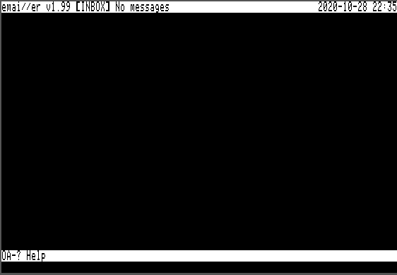
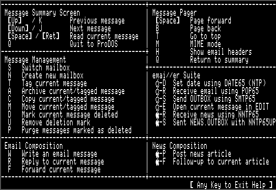
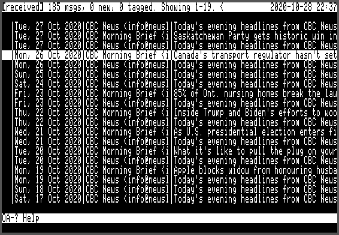
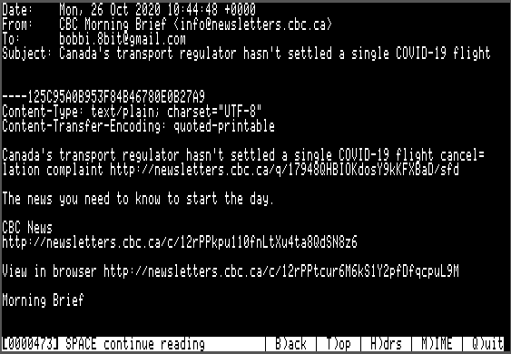
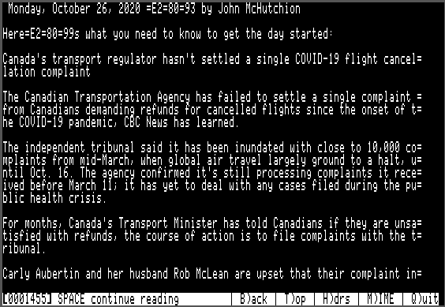
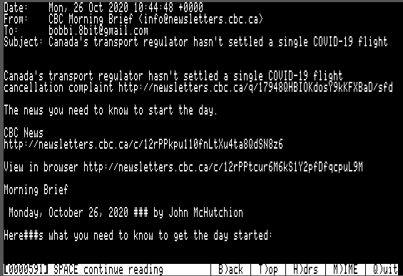
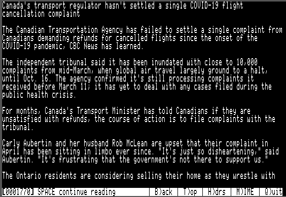
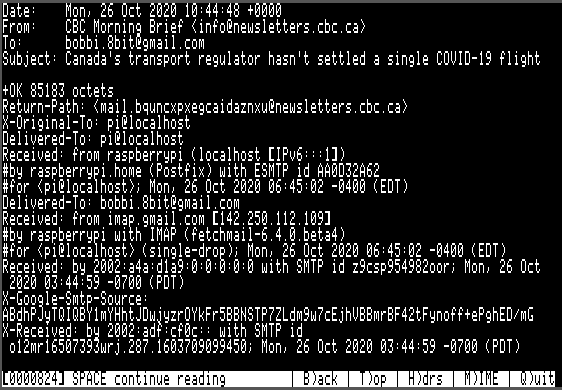
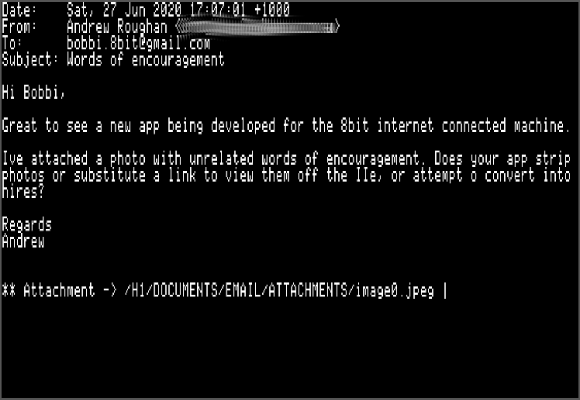

# Apple II Email and Usenet News Suite

<p align="center"></p>

[Back to Main emai//er Docs](README-emailler.md#detailed-documentation-for-email-functions)

## `EMAIL.SYSTEM`

EMAIL is a simple mail user agent for reading and managing email.

<p align="center"></p>

<p align="center"></p>

<p align="center"></p>

When the EMAIL application is started it will show the `INBOX` in the summary screen.  This shows the following important information for each message:

  - Tag - Shows `T` if the message is tagged.
  - Read/Unread/Deleted - Shows `*` if the message is new (unread).  Shows `D` if the message is marked to be deleted.
  - From, Date and Subject headers

19 messages may be shown on the summary screen.  If the mailbox has more than 19 messages there will be multiple screens.

Main menu commands:

 - Up arrow / `K` - Move the selection to the previous message. If this is the first message on the summary screen but this is not the first page, then load the previous page of messages and select the last item.
 - Down arrow / `J` - Move the selection to the next message.  If this is the last message on the summary screen but there are further messages on subsequent pages, then load the next page of messages and select the first item.
 - `SPC` / `RET` - View the currently selected message in the message pager.
 - `E)ditor` - Open the currently selected message in `EDIT.SYSTEM`.
 - `S)witch` mbox - Switch to viewing a different mailbox. Press `S` then enter the name of the mailbox to switch to at the prompt.  The mailbox must already exist or an error message will be shown.  You may enter `.` as a shortcut to switch back to `INBOX`.
 - `N)ew mbox` - Create a new mailbox.  Press 'N' then enter the name of the mailbox to be created.  It will be created as a directory within the email root directory and `NEXT.EMAIL` and `EMAIL.DB` files will be created for the new mailbox.
 - `C)opy` - Copy message(s) to another mailbox.  If no messages are tagged (see below) then the copy operation will apply to the current message only.  If messages are tagged then the copy operation will apply to the tagged messages.
 - `M)ove` - Move message(s) to another mailbox. If no messages are tagged (see below) then the move operation will apply to the current message only.  If messages are tagged then the copy operation will
 apply to the tagged messages.  Moving a message involves two steps - first the message is copied to the destination mailbox and then it is marked as deleted in the source mailbox.
 - `A)rchive` - This is a shortcut for moving messages to the `RECEIVED` mailbox.
 - `D)el` - Mark message as deleted.
 - `U)ndel` - Remove deleted mark from a message.
 - `P)urge` - Purge deleted messages from the mailbox.  This command iterates through all the messages marked for deletion and removes their files from the mailbox.  A new `EMAIL.DB` is created, compacting any 'holes' where files have been deleted.
 - `T)ag` - Toggle tag on message for collective `C)opy`, `M)ove` and `A)rchive` operations.  Moves to the next message automatically to allow rapid tagging of messages.
 - `W)rite` - Prepare a new blank outgoing email and place it in `OUTBOX` ready for editing.
 - `R)eply` - Prepare a reply to the selected email and place it in `OUTBOX` ready for editing.
 - `F)orward` - Prepare a forwarded copy of the selected email and place it in `OUTBOX` ready for editing.
 - `<` - Switch the order of the email summary to show the most recently added messages first.  The indicator in the status bar will change to `>` to indicate the order.
 - `>` - Switch the order of the email summary to show the most recently added messages last.  The indicator in the status bar will change to `<` to indicate the order.
 - `Open Apple`+`D` - Run `DATE65.SYSTEM` to set the system date using NTP (if you don't have a real time clock.)
 - `Open Apple`+`E` - Edit message in `EDIT.SYSTEM`.  From `EDIT.SYSTEM` `Open Apple`-`Q` will return you to `EMAIL.SYSTEM`.
 - `Open Apple`+`R` - Retreive messages from email server.  This runs `POP65.SYSTEM`, which in turn will return you to the `EMAIL.SYSTEM` main menu.
 - `Open Apple`+`S` - Send outbox messages to email server.  This runs `SMTP65.SYSTEM`, which in turn will return you to the `EMAIL.SYSTEM` main menu.
 - `Closed Apple`+`R` - Retreive news articles from news server.  This runs `NNTP65.SYSTEM`, which in turn will return you to the `EMAIL.SYSTEM` main menu.
 - `Open Apple`+`S` - Send queued outgoing news messages to news server.  This runs `NNTP65UP.SYSTEM`, which in turn will return you to the `EMAIL.SYSTEM` main menu.
 - `Q)uit` - Quit from the EMAIL user interface.

By using the `Open Apple`+`R` command to retrieve messages and the `Open Apple`-`S` command to transmit messages to the server, it is possible to retreive, review, respond, compose and transmit messages all without leaving the `EMAIL.SYSTEM` environment.

### Mail Pager

Pressing space or return will open the currently-selected message in the mail pager.  The mail pager provides a comfortable interface for reading email, allowing rapid forwards and backwards paging through the email body.  This is done by saving the formatted email text to a `SCROLLBACK` file in the email root directory.

Below the message text, a menu bar is shown with the following options:

 - `SPACE continue reading` - Pressing space advances through the file a screen at a time.  This option is not available when at the end of the file.
 - `B)ack` - Page back one screen.
 - `T)op` - Go back to the top of the message.
 - `H)drs` - Show message headers.
 - `M)IME` - Decode MIME message (see below).
 - `Q)uit` - Return to the email summary screen.

There are three separate viewing modes:

 - Plain text view (no headers) - This is the default view, and may be accessed by hitting the `T)op` key.  It shows the raw email text, starting immediately *after* the headers.
 - Plain text view (with headers) - This mode is accessed using the `H)drs` option.  It shows the raw email text, starting from the very beginning.  Be aware that on today's Internet, most messages have 4KB or more of headers.  These are all preserved in EMAIL, but hidden from the user by default.
 - MIME view - This mode is entered using the `M)IME` option.  Many email providers encode even simple text-only messages in a MIME envelope (using Quoted-Printable encoding).  Although these messages are readable in the plain text views, they are far more pleasant to read in MIME view.

Long lines are word-wrapped at 80 columns in all three views.

#### Plain Text View `T)op`

Here the selected message is shown in plain text. This is the default view mode, when selecting a message from the email summary with `RET`.  In this particular case, we can see that the email is encoded in *Quoted-Printable* format (the `=` signs at the end of each line are a give away).

<p align="center"></p>

Here is the next page of plain text.  The *Quoted-Printable* formatting is even more obvious now:

<p align="center"></p>

#### MIME View `M)IME`

Hitting the `M` key switches to MIME mode which will decode the *Quoted-Printable* text. If there are MIME attachements, MIME mode will offer to decode them and save them to file.

<p align="center"></p>

Here is the second page, decoded:

<p align="center"></p>

#### Headers View `H)drs`

The third view mode is 'headers' mode which shows all email header fields. Hitting the `H` key shows the headers for this message:

<p align="center"></p>

### MIME Support

EMAIL is able to decode messages encoded with the Multipurpose Internet Mail Extensions (MIME).  This allows email bodies which are encoded as anything other than plain text email to be extracted and formatted for the screen, and also provides support for extracting and saving to disk email attachments.

EMAIL can also compose MIME messages with attached files, using `ATTACHER.SYSTEM` as a helper application.

#### Encodings

MIME allows a number of message encodings, and EMAIL supports all those that make sense (everything except 8bit and Binary).

 - 7bit
 - Quoted-printable
 - Base64

Quoted-printable encoding is commonly used for email bodies where the majority of the characters are US ASCII, with a few UTF-8 chars here and there.  Base64 is most often used for encoding binary files.  However it is possible (although unusual) to encode a binary attachment in Quoted-printable or to use Base64 for encoding ASCII text.  The important point is that the *encoding* is independent of the *deposition* (ie: whether the object is to be shown inline or offered as an attachment to download.

#### Inline Rendering

All email body text (which could be non-MIME text, or `text/plain` content represented in one of the encodings described above is filtered to remove non-ASCII characters and word-wrapped to fit the 80 column screen.

Unicode UTF-8 characters are not supported and will either be omitted or displayed as a couple of garbage characters.  It is not feasible to (fully) support UTF-8 on an 8 bit system, unfortunately.

EMAIL will not display objects of type `text/html` but will instead show a placeholder, so the user is aware the HTML was omitted.

#### Attachments

<p align="center"></p>

Objects of any other type will be treated as attachments and offered for download.

Any object which has a MIME `filename=` field, regardless of type, will be treated as an attachment and offered for download.

When an attachment is encountered, while reading an email in `M)IME` mode, the following prompt will be shown:

```
Okay to download /H1/DOCUMENTS/EMAIL/ATTACHMENTS/filename.typ? (y/n) >
```	

If you respond in the affirmative, the attachment will be decoded (usually from Base64) and saved to the filename indicated.  If you are unable to download attachments, be sure the `ATTACHMENTS` directory exists and is writable.

If you enter `n`, the attachment will be skipped.  Due to the large size of some attachments, even skipping over them may take several seconds.

A progress spinner is shown in either case.

### Tagging of Messages

It is possible to manually tag or untag messages using the `T)ag` key in the summary screen.  Collective operations such as `C)opy` or `M)ove` may then be performed on the tagged messages.

Each time the `T)ag` key is pressed, the current message will be tagged and the selection moved down.  This allows large numbers of message to be tagged or untagged rapidly.

### Deletion of Messages

Deletion of messages in EMAIL is a two step process.  First a message must be marked as deleted using the `D)el` function.  This will be shown as a `D` in the first column on the summary screen.

A message which is marked as deleted may be unmarked by selecting it and pressing `U)ndel`.

All messages with the deleted `D` flag may be permanently deleted from disk by using the `P)urge` function.  Use this with care, since deleted messages may not be easily recovered.

### New Message Status

When messages are first received they are marked as new, which is shown with an asterix `*` in the first column on the summary screen.  When they are read this status will be cleared.

### Persistence of Message State

The message state is persisted in the `EMAIL.DB` file:

 - New or already read
 - Deleted flag
 - Tag

### Sending of Messages

The EMAIL system currently includes a basic screen editor for message composition.  This editor is currently under development and may be a little rough.  It is also possible to use an external editor of your choice for composing emails.  The advantage to this is you can choose whichever editor you prefer, provided it can handle plain Apple II text files.  I find the editor which is built into the Proterm 3.1 communications program to be quite satisfactory for this purpose.

Sending of an email message is a three step process:

 - Use the `W)rite`, `R)eply` or `F)wd` functions in EMAIL to create an email template file and store it in `OUTBOX`.
 - The system will display the full pathname of the template file created. And prompt `Open in editor - sure? (y/n)`
 - If you enter 'y', `EMAIL.SYSTEM` will load `EDIT.SYSTEM`, the integrated editor, passing the filename of the template file as a parameter, so the file is automatically opened for editing.
 - You may edit the file in `EDIT.SYSTEM` using the editing keys shown below.  The editor's keys are based upon Apple's Appleworks word processor, so if you are familiar with that package you should feel at home.  Press `Open Apple`-`S` to save the file to disk and `Open Apple`-`Q` to return to `EMAIL.SYSTEM`.
 - Upon exit, `EDIT.SYSTEM` will prompt `Add attachments - Sure? (y/n)`.  If you enter 'n' then `EDIT.SYSTEM` will simply reload `EMAIL.SYSTEM`.  If you enter 'y', then `EDIT.SYSTEM` will instead load `ATTACHER.SYSTEM`, which allows you to add one or more file attachments to the email message.  Once the attachments have been added, `ATTACHER.SYSTEM` will reload `EMAIL.SYSTEM`.  `ATTACHER.SYSTEM` is discussed in more detail below.
 - Once you are back in the `EMAIL.SYSTEM` UI, you can choose to send the messages in `OUTBOX` to your mail server at any time.  To do this, press `Open Apple`-`S` at the `EMAIL.SYSTEM` main menu.  This will start `SMTP65.SYSTEM`, which sends each message to the SMTP server and moves it to the `SENT` mailbox.
 - If you answer `n` to the `Open in editor - sure? (y/n)` prompt:
   - The template file will simply be placed in the `OUTBOX` where you can use your favourite text editor to add the email body.  You may also modify the `To:`, `cc:`, `Subject:` or `Date:` headers.
   - Once you are satisfied with your edits and have saved the file, run `SMTP65.SYSTEM` to send the file to your mail server and copy it to the `SENT` mailbox.

There are three ways to write an email:

 - `W)rite` starts a blank email.  You will be prompted for the recipient, cc and subject line.  The date is automatically filled in.  Note that you may leave the cc entry blank, if no carbon copies are to be sent.
 - `R)eply` creates a reply to the selected email, with the email included inline.  You will be prompted for the cc only (you can leave this blank).
 - `F)wd` forwards the selected email.  You will be prompted for the recipient and cc (you can leave the cc blank, if desired.)

However you create your template email, take note of the filename which is displayed in the status line.  The file will be created in the `OUTBOX` directory (`/H1/DOCUMENTS/EMAIL/OUTBOX` with our example settings.)

[Back to Main emai//er Docs](README-emailler.md#detailed-documentation-for-email-functions)

