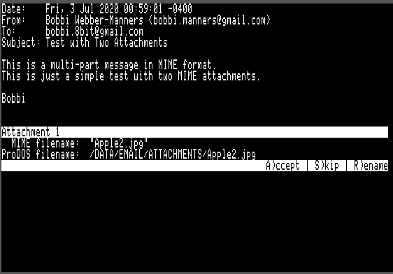
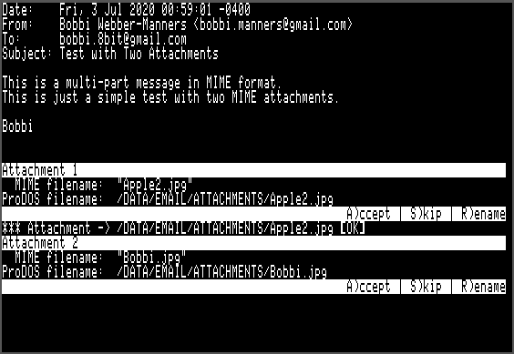
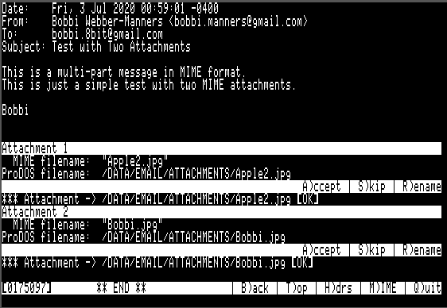

# Apple II Email and Usenet News Suite

[Back to Main emai//er Docs](README.md#detailed-documentation-for-email-functions)

## `EMAIL.SYSTEM`

`EMAIL.SYSTEM` is a simple mail user agent for reading and managing email and news articles. It serves as the main user interface for the entire Emai//er suite.

### Message Summary

When the `EMAIL.SYSTEM` application is started it will show the `INBOX` in the summary screen.  The first time `EMAIL.SYSTEM` is started, `INBOX` will be empty:

Here is a view of the first page of my `RECEIVED` mailbox, showing the first 19 messages out of a total of 185:

The summary screen shows the status of each message in the two left hand columns:

  - Column One shows the tag status: Shows `T` if the message is tagged blank otherwise.
  - Column Two shows the Read/Unread/Deleted status: Shows `*` if the message is new (unread).  Shows `D` if the message is marked to be deleted.

The rest of the line shows the From, Date and Subject headers of the message.

19 messages may be shown on the summary screen.  If the mailbox has more than 19 messages there will be multiple screens.

### Online Help

The command `Open Apple`-? will show the help screen, with a summary of all the keyboard commands:

### Main Menu Commands

`EMAIL.SYSTEM` uses single character commands for most functions. Commands that involve invoking other helper applications use either the `Open Apple` or `Closed Apple` key as a modifier.  The `Open Apple` key modifier is used for invoking helper applications that handle email, while the `Closed Apple` key is used for operations related to Usenet news.

 - Message Summary Screen:
   - `Up arrow` / `K` - Move the selection to the previous message. If this is the first message on the summary screen but this is not the first page, then load the previous page of messages and select the last item.
   - `Down arrow` / `J` - Move the selection to the next message.  If this is the last message on the summary screen but there are further messages on subsequent pages, then load the next page of messages and select the first item.
   - `Space` / `Return` - View the currently selected message in the message pager.
   - `<` - Switch the order of the email summary to show the most recently added messages first.  The indicator in the status bar will change to `>` to indicate the order.
   - `>` - Switch the order of the email summary to show the most recently added messages last.  The indicator in the status bar will change to `<` to indicate the order.
   - `Q` - Quit to ProDOS.

 - Message Management: 
   - `S` - Switch` mbox - Switch to viewing a different mailbox. Press `S` then enter the name of the mailbox to switch to at the prompt.  The mailbox must already exist or an error message will be shown.  You may enter `.` as a shortcut to switch back to `INBOX`.
   - `N` - New mbox` - Create a new mailbox.  Press 'N' then enter the name of the mailbox to be created.  It will be created as a directory within the email root directory and `NEXT.EMAIL` and `EMAIL.DB` files will be created for the new mailbox.
   - `T` - Tag current message - Toggle tag on message for collective `C)opy`, `M)ove` and `A)rchive` operations.  Moves to the next message automatically to allow rapid tagging of messages.
   - `A` - Archive current message (or tagged messages) - This is a shortcut for moving messages to the `RECEIVED` mailbox.
   - `C` - Copy current message (or tagged messages) - Copy message(s) to another mailbox.  If no messages are tagged (see below) then the copy operation will apply to the current message only.  If messages are tagged then the copy operation will apply to the tagged messages.
   - `M` - Move current message (or tagged messages) - Move message(s) to another mailbox. If no messages are tagged (see below) then the move operation will apply to the current message only.  If messages are tagged then the copy operation will apply to the tagged messages.  Moving a message involves two steps - first the message is copied to the destination mailbox and then it is marked as deleted in the source mailbox.
   - `D` - Delete - Mark current message as deleted.
   - `U` - Undelete - Remove deleted mark from a message.
   - `P` - Purge messages - Purge deleted messages from the mailbox.  This command iterates through all the messages marked for deletion and removes their files from the mailbox.  A new `EMAIL.DB` is created, compacting any 'holes' where files have been deleted.

 - Email Composition:
   - `W` - Write an email message - Prepare a new blank outgoing email and place it in `OUTBOX` ready for editing.
   - `R` - Reply to current message - Prepare a reply to the selected email and place it in `OUTBOX` ready for editing.
   - `F` - Forward current message - Prepare a forwarded copy of the selected email and place it in `OUTBOX` ready for editing.

 - News Article Composition:
   - `Closed Apple`-`P` - Post news article - Prepare a new news article.
   - `Closed Apple`-`F` - Post a follow-up - Prepares a new news article following up on the currently selected news article.

 - emai//er Suite: 
   - `Open Apple`+`D` - Run `DATE65.SYSTEM` to set the system date using NTP (if you don't have a real time clock.)
   - `Open Apple`+`R` - Run `POP65.SYSTEM` to retreive messages from email server.
   - `Open Apple`+`S` - Run `SMTP65.SYSTEM` to send any messages in `OUTBOX` to the email server.
   - `Open Apple`+`E` - Edit message in `EDIT.SYSTEM`.  From `EDIT.SYSTEM` `Open Apple`-`Q` will return you to `EMAIL.SYSTEM`.  The message is opened in read-only mode to prevent accidental corruption of stored messages. If you want to save your changes, first choose a new file name using the `Open Apple`-`N` command in `EDIT.SYSTEM`, the `Open Apple`-`S` to save.
   - `Closed Apple`+`R` - Run `NNTP65.SYSTEM` to retreive news articles from news server.
   - `Closed Apple`+`S` - Run `NNTP65UP.SYSTEM` to send any news articles in `NEWS.OUTBOX` to the news server.

### Integrated Environment

By using the `Open Apple`+`R` command to retrieve email messages and the `Open Apple`-`S` command to transmit email messages to the server, it is possible to retreive, review, respond, compose and transmit emails all without leaving the `EMAIL.SYSTEM` environment.

Similarly, by using the `Closed Apple`+`R` command to retrieve news articles and the `Open Apple`-`S` command to transmit news articles to the server, it is possible to retreive, review, follow-up, compose and transmit articles all without leaving the `EMAIL.SYSTEM` environment.

### Message Pager

Pressing space or return will open the currently-selected message in the mail pager.  The mail pager provides a comfortable interface for reading email, allowing rapid forwards and backwards paging through the email body.  This is done by saving the formatted email text to a `SCROLLBACK` file in the email root directory.

Below the message text, a menu bar is shown with the following options:

 - `SPACE continue reading` - Pressing space advances through the file a screen at a time.  This option is not available when at the end of the file.
 - `B)ack` - Page back one screen.
 - `T)op` - Go back to the top of the message.
 - `H)drs` - Show message headers.
 - `M)IME` - Decode MIME message (see below).
 - `Q)uit` - Return to the email summary screen.

There are three separate viewing modes:

 - Plain text view (no headers) - This is the default view, and may be accessed by hitting the `T)op` key.  It shows the raw email text, starting immediately *after* the headers.
 - Plain text view (with headers) - This mode is accessed using the `H)drs` option.  It shows the raw email text, starting from the very beginning.  Be aware that on today's Internet, most messages have 4KB or more of headers.  These are all preserved in EMAIL, but hidden from the user by default.
 - MIME view - This mode is entered using the `M)IME` option.  Many email providers encode even simple text-only messages in a MIME envelope (using Quoted-Printable encoding).  Although these messages are readable in the plain text views, they are far more pleasant to read in MIME view.

Long lines are word-wrapped at 80 columns in all three views.

#### Plain Text View `T)op`

Here the selected message is shown in plain text. This is the default view mode, when selecting a message from the email summary with `Return`.  In this particular case, we can see that the email is encoded in *Quoted-Printable* format (the `=` signs at the end of each line are a give away).

Here is the next page of plain text.  The *Quoted-Printable* formatting is even more obvious now:

#### MIME View `M)IME`

Hitting the `M` key switches to MIME mode which will decode the *Quoted-Printable* text. If there are MIME attachements, MIME mode will offer to decode them and save them to file.

Here is the second page, decoded:

#### Headers View `H)drs`

The third view mode is 'headers' mode which shows all email header fields. Hitting the `H` key shows the headers for this message:

### MIME Support

EMAIL is able to decode messages encoded with the Multipurpose Internet Mail Extensions (MIME).  This allows email bodies which are encoded as anything other than plain text email to be extracted and formatted for the screen, and also provides support for extracting and saving to disk email attachments.

EMAIL can also compose MIME messages with attached files, using `ATTACHER.SYSTEM` as a helper application.

#### Encodings

MIME allows a number of message encodings, and EMAIL supports all those that make sense (everything except 8bit and Binary).

 - 7bit
 - Quoted-printable
 - Base64

Quoted-printable encoding is commonly used for email bodies where the majority of the characters are US ASCII, with a few UTF-8 chars here and there.  Base64 is most often used for encoding binary files.  However it is possible (although unusual) to encode a binary attachment in Quoted-printable or to use Base64 for encoding ASCII text.  The important point is that the *encoding* is independent of the *deposition* (ie: whether the object is to be shown inline or offered as an attachment to download.

#### Inline Rendering

All email body text (which could be non-MIME text, or `text/plain` content represented in one of the encodings described above is filtered to remove non-ASCII characters and word-wrapped to fit the 80 column screen.

Unicode UTF-8 characters are not supported and will either be omitted or displayed as a couple of garbage characters.  It is not feasible to (fully) support UTF-8 on an 8 bit system, unfortunately.

EMAIL will not display objects of type `text/html` but will instead show a placeholder, so the user is aware the HTML was omitted.

#### Attachments

Objects of any other type will be treated as attachments and offered for download.

Any object which has a MIME `filename=` field, regardless of type, will be treated as an attachment and offered for download.

Whenever an attachment is encountered while reading an email in `M)IME` mode, `EMAIL.SYSTEM` will display the MIME filename (ie: the filename encoded in the email) and the ProDOS filename (which is the file to which the attachment will be downloaded). The default ProDOS filename is simply composed of the path to the `ATTACHMENTS` directory, followed by the MIME filename. This is followed by the prompt `A)ccept | S)kip | R)ename`, as seen in the following screenshot:	

The options are as follows:

 - `A)ccept` - The attachment will be decoded (usually from Base64) and saved to the ProDOS filename shown.
 - `S)kip` - `EMAIL.SYSTEM` will skip over the MIME attachment without downloading it.
 - `R)ename` - `EMAIL.SYSTEM` will prompt for a filename. This filename will replace the ProDOS filename. This function is useful because ProDOS is quite restricted in terms of the permissible characters in a filename compared to other more modern operating systems, so attachments may be received in an email whose filenames may not be created within ProDOS.

After the first attachment has been downloaded, the display is as follows:

Finally, after both attachments have been downloaded:

If you are unable to download attachments, be sure the `ATTACHMENTS` directory exists and is writable.

If you enter `n`, the attachment will be skipped.  Due to the large size of some attachments, even skipping over them may take several seconds.

A progress spinner is shown in either case.

### Tagging of Messages

It is possible to manually tag or untag messages using the `T)ag` key in the summary screen.  Collective operations such as `C)opy` or `M)ove` may then be performed on the tagged messages.

Each time the `T)ag` key is pressed, the current message will be tagged and the selection moved down.  This allows large numbers of message to be tagged or untagged rapidly.

### Deletion of Messages

Deletion of messages in EMAIL is a two step process.  First a message must be marked as deleted using the `D)el` function.  This will be shown as a `D` in the first column on the summary screen.

A message which is marked as deleted may be unmarked by selecting it and pressing `U)ndel`.

All messages with the deleted `D` flag may be permanently deleted from disk by using the `P)urge` function.  Use this with care, since deleted messages may not be easily recovered.

### New Message Status

When messages are first received they are marked as new, which is shown with an asterix `*` in the first column on the summary screen.  When they are read this status will be cleared.

### Persistence of Message State

The message state is persisted in the `EMAIL.DB` file:

 - New or already read
 - Deleted flag
 - Tag

### Sending of Email Messages

Emai//er includes a screen editor, `EDIT.SYSTEM`, for message composition. It is also possible to use an external editor of your choice for composing emails.

Sending of an email message is a three step process (four steps if you also add attachments to the outgoing message):

 1) Use the `W` (write), `R` (Reply) or `F` (Forward) functions in `EMAIL.SYSTEM` to create an email template file and store it in `OUTBOX`.
 2) The system will automatically open the email template file in the editor, `EDIT.SYSTEM`. You may edit the file in `EDIT.SYSTEM` using the editing keys shown [here](README-edit.md).  Press `Open Apple`-`S` to save the file to disk and `Open Apple`-`Q` to return to `EMAIL.SYSTEM`.
 3) Upon exit, `EDIT.SYSTEM` will prompt `Add attachments - Sure? (y/n)`.  If you enter 'n' then `EDIT.SYSTEM` will simply reload `EMAIL.SYSTEM`.  If you enter 'y', then `EDIT.SYSTEM` will instead load `ATTACHER.SYSTEM`, which allows you to add one or more file attachments to the email message.  Once the attachments have been added, `ATTACHER.SYSTEM` will reload `EMAIL.SYSTEM`.  `ATTACHER.SYSTEM` is discussed in more detail [here](README-attacher.md).
 4) Once you are back in the `EMAIL.SYSTEM` UI, you can choose to send the messages in `OUTBOX` to your mail server at any time.  To do this, press `Open Apple`-`S` at the `EMAIL.SYSTEM` main menu.  This will start `SMTP65.SYSTEM`, which sends each message to the SMTP server and moves it to the `SENT` mailbox.

There are three ways to create the template email ready for editing:

 - `W` (write) starts a blank email.  You will be prompted for the recipient, cc and subject line.  The date is automatically filled in.  Note that you may leave the cc entry blank, if no carbon copies are to be sent.
 - `R` (reply) creates a reply to the selected email, with the email included inline.  You will be prompted for the cc only (you can leave this blank).
 - `F` (forward) forwards the selected email.  You will be prompted for the recipient and cc (you can leave the cc blank, if desired.)

### Sending of News Articles

Emai//er includes a screen editor, `EDIT.SYSTEM`, for message composition. It is also possible to use an external editor of your choice for composing emails.

Sending of an news article is a three step process:

 1) Use the `Closed Apple`-`P` (post news article), or `Closed Apple`-`F` (follow-up to current article) functions in `EMAIL.SYSTEM` to create an article template file and store it in `NEWS.OUTBOX`.
 2) The system will automatically open the article template file in the editor, `EDIT.SYSTEM`. You may edit the file in `EDIT.SYSTEM` using the editing keys shown [here](README-edit.md).  Press `Open Apple`-`S` to save the file to disk and `Open Apple`-`Q` to return to `EMAIL.SYSTEM`.
 3) Once you are back in the `EMAIL.SYSTEM` UI, you can choose to send the messages in `NEWS.OUTBOX` to your news server at any time.  To do this, press `Closed Apple`-`S` at the `EMAIL.SYSTEM` main menu.  This will start `NNTP65UP.SYSTEM`, which sends each message to the NNTP server and moves it to the `NEWS.SENT` mailbox.

There are two ways to create the template news article ready for editing:

 - `Closed Apple`-`P` (post news article) starts a blank article. You will be prompted for the name of the newsgroup or newsgroups to publish the article to and the subject line.  The date is automatically filled in.
 - `Closed Apple`-`F` (follow up to current article) creates a response to the currently selected news article. The newsgroup name and the subject line are automatically composed.

[Back to Main emai//er Docs](README.md#detailed-documentation-for-email-functions)

