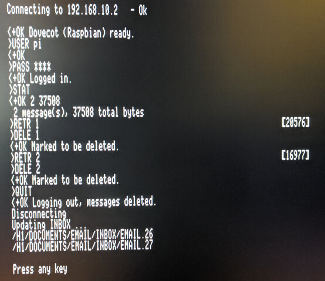
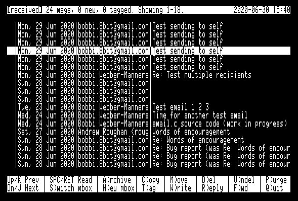
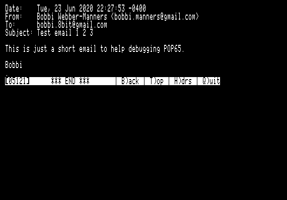
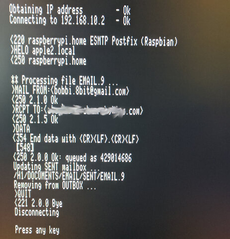

# Apple II Email Suite

<p align="center"></p>

The AppleII Email Suite consists of the following four ProDOS programs:

 - `POP65.SYSTEM` is a Post Office Protocol version 3 (POP3) client for the Apple II with Uthernet-II card.
 - `EMAIL.SYSTEM` is a simple user interface for reading and managing email.  It works together with `POP65` and `SMTP65`.
 - `SMTP65.SYSTEM` is a Simple Mail Transport Protocol (SMTP) client for the Apple II with Uthernet-II card.
 - `REBUILD.SYSTEM` is a utility for rebuilding mailbox databases, should they become corrupted.  This can also be used for bulk import of messages.

## Overview

The software has been designed to be modular, which allows new protocols to be added later for handling incoming and outgoing mail.  POP3 was selected as the email download/ingest protocol because it is simple and there are many available server implementations.  SMTP was chosen as the outgoing protocol due to its almost universal adoption for this purpose.  Once again, there are many server-side implementations to choose from.  It may be possible, for example, to add an NNTP module to allow reading and posting of Usenet articles.

One problem faced by any retrocomputing project of this type is that Transport Layer Security (TLS) is endemic on today's Internet.  While this is great for security, the encryption algorithms are not feasible to implement on a 6502-based system.  In order to bridge the plain text world of the Apple II to today's encrypted Internet, I have set up a Raspberry Pi using several common open source packages as a gateway.  The Raspberry Pi uses Fetchmail to download messages from Gmail's servers using the IMAPS protocol (with TLS) and hands them off to Postfix, which is used at the system mailer (MTA) on the Pi.  I use Dovecot as a POP3 server to offer a plain text connection to the `POP65.SYSTEM` application on the Apple II.  For outgoing messages, I configured Postfix to accept plain text SMTP connections from `SMTP65.SYSTEM` on the Apple II and to relay the messages to Gmail's servers using secure SMTPS.  The configuration of the Raspberry Pi (which was originally set up as a gateway for SAM2 email under GSOS on the Apple IIgs) is documented [here](README-gmail-gateway.md).

A few design principles that I have tried to apply:

  - *Simplicity* This software runs on the Apple //e and currently fits within 64KB of RAM (although I may use the 64KB of aux memory for future enhancements.)  It is important that is be as simple and small as possible.  The code is written in C using cc65, which allows more rapid evolution when compared to writing in assembly language, at the expense of larger code which uses more memory.
  - *Modularity* Where it makes sense to split the functionality into separate modules it makes sense to do so in order to make the best use of available memory.
  - *Speed* The software should make the most of the limited hardware of the Apple //e in order to allow speedy browsing of emails without needing much processor or disk activity.
  - *Avoidance of Limits* I tried to avoid the imposition of arbitrary limits to message length or the number of messages in a folder.
  - *Veracity* The software should never modify or discard information. Incoming emails are saved to disk verbatim, including all headers.  The system hides the headers when displaying the emails, but they are available for inspection or further processing.  The only change that is made to incoming messages is to convert the CR+LF line endings to Apple II CR-only line endings.

`POP65.SYSTEM` and `SMTP65.SYSTEM` are based on Oliver Schmitd's excellent IP65 TCP/IP framework (in particular they follow the design of `WGET65.SYSTEM`.)  Without IP65, this software would not have been possible.

## System Setup and Configuration

### Configuration File

The system configuration file is called `POP65.CFG`.  It is a straightforward ProDOS text file, with one parameter per line.  You may edit this file using any ProDOS text editor.  When editing the file be careful not to add or delete any lines - this file has no grammar and the lines *must* appear in the expected order.

All three of the mail programs `POP65.SYSTEM`, `EMAIL.SYSTEM` and `SMTP65.SYSTEM` share this configuration file.

Here is an example config file (with passwords replaced with `****` for obvious reasons):

```
192.168.10.2
pi
******
NODELETE
192.168.10.2
apple2.local
/H1/DOCUMENTS/EMAIL
bobbi.8bit@gmail.com
```

The lines are as follows, in order:

 1) IP address of the POP3 server for receiving new mail.
 2) Username to use when connecting to POP3.
 3) Password for POP3 connection (in plaintext).
 4) If this string is exactly `DELETE` then messages will be deleted from the POP3 server after downloading.  Otherwise they are left on the server.  `DELETE` is the normal setting, but `NODELETE` (or any other nonsense value) can be helpful for debugging, allowing the same messages to be downloaded from the POP3 server again and again.
 5) IP address of the SMTP server for sending outgoing mail.
 6) Domain name that is passed to the SMTP server on connection.  The way my SMTP server (Postfix) is configured, it doesn't seem to care about this.
 7) ProDOS path to the root of the email folder tree.  Mailboxes will be created and managed under this root path.
 8) Your email address.  Used as the sender's address in outgoing messages.

### Creating Directories

To get started, you will need to create the following directories:

 - The email root directory (`/H1/DOCUMENTS/EMAIL` in the example config)
 - The `SPOOL` directory, used by POP65, within the email root directory.  This will be `/H1/DOCUMENTS/EMAIL/SPOOL` for our example configuration.
 - The `INBOX` directory, used by POP65, within the email root directory.  This will be `/H1/DOCUMENTS/EMAIL/INBOX` for our example configuration.
 - The `OUTBOX` directory, used by SMTP65, within the email root directory.  This will be `/H1/DOCUMENTS/EMAIL/OUTBOX` for our example configuration.
 - The `ATTACHMENTS` directory, used by EMAIL for storing downloaded MIME attachments, within the email root directory.  This will be `/H1/DOCUMENTS/EMAIL/ATTACHMENTS` for our example configuration.

You can create these directories in ProDOS `BASIC.SYSTEM` as follows:

```
] CREATE /H1/DOCUMENTS/EMAIL
] CREATE /H1/DOCUMENTS/EMAIL/SPOOL
] CREATE /H1/DOCUMENTS/EMAIL/INBOX
] CREATE /H1/DOCUMENTS/EMAIL/OUTBOX
] CREATE /H1/DOCUMENTS/EMAIL/ATTACHMENTS
```

You will also want to create a couple of mailboxes such as `RECEIVED` and `SENT`.  If you do not create a `SENT` mailbox then SMTP65 will be unable to complete the sending of messages and will give an error.  To create these mailboxes, run `EMAIL.SYSTEM` and press `N` for N)ew mailbox.  At the prompt, enter the name of the mailbox to be created: `RECEIVED`, and press return.  Repeat this to create the the `SENT` mailbox.

These are the minimum mailboxes you need to get started.  You may create more mailboxes to organize your mail at any time.

### Mailboxes

Each mailbox consists of the following:

 - A directory under the email root, and within this directory
 - Email messages are stored on per file, in plain Apple II text files (with CR line endings) named `EMAIL.nn` where `nn` is an integer value
 - A text file called `NEXT.EMAIL`.  This file initially contains the number 1.  It is used when naming the individual `EMAIL.nn` files, and is incremented by one each time.  If messages are added to a mailbox and nothing is ever deleted they will be sequentially numbered `EMAIL.1`, `EMAIL.2`, etc.
 - A binary file called `EMAIL.DB`.  This file contains essential information about each email message in a quickly accessed format.  This allows the user interface to show the email summary without having to open and read each individual email file.  This file is initially empty and a fixed size record is added for each email message.

The easiest way to create additional mailboxes is using the `N)ew` command in `EMAIL.SYSTEM`.

`POP65.SYSTEM` knows how to initialize `INBOX` but the directory must have been created first.

Note that `SPOOL` is not a mailbox, just a directory.  `OUTBOX` is also not a 'proper' mailbox - it has `NEXT.EMAIL` but not `EMAIL.DB`.

If the `EMAIL.DB` file for a mailbox gets corrupted, it will no longer possible to browse the summary and read the messages in `EMAIL.SYSTEM`.  The utility `REBUILD.SYSTEM` can be used to rebuild the `EMAIL.DB` and `NEXT.EMAIL` files for an existing mailbox (see below.)

## `POP65.SYSTEM`

<p align="center"></p>

POP65 is a Post Office Protocol v3 (POP3) client for the Apple II.  It requires an Uthernet-II ethernet card and will not work with other interfaces without modification, because it uses the W5100 hardware TCP/IP stack.  POP65 is used to download new email messages from a POP3 email server.  (I use Dovecot on the Raspberry Pi as my POP3 server, but other POP3 servers should work too.)

Before running `POP65.SYSTEM` for the first time, be sure you have created the email root directory and the `SPOOL` directory, as described above.  POP3 will initialize the `INBOX` mailbox, creating `NEXT.EMAIL` and `EMAIL.DB` files if they do not exist.

POP65 runs without any user interaction and performs the following tasks:

 - Detect Uthernet-II
 - Obtain IP address using DHCP
 - Connect to POP3 server using parameters from first three lines of `POP65.CFG`. (`USER` and `PASS` commands)
 - Enquire how many email messages are waiting. (`STAT` command)
 - Download each email in turn (`RETR` command) and store it in the `SPOOL` directory.
 - If configured to delete messages on the POP3 server, messages are deleted after successful download (`DELE` command)
 - Once all messages have been downloaded, disconnect from the POP3 server (`QUIT` command)
 - Scan each downloaded message in the `SPOOL` directory and import the message into `INBOX`:
   - Read `INBOX/NEXT.EMAIL` to find out the next number in sequence and allocate that for the new message.
   - Copy the message from `SPOOL` to `INBOX/EMAIL.nn` (where `nn` is the next sequence number) while scanning it for the following information:
     - Sender (`From:`) header
     - Recipient (`To:`) header
     - Date and time (`Date:`) header
     - Subject (`Subject:`) header
     - Offset in bytes to start of message body
   - Store all of the information obtained from scanning the message in `INBOX/EMAIL.DB`.
   - Update `INBOX/EMAIL.nn`, incrementing the number by one.
   - Iterate until all messages in `SPOOL` are ingested into `INBOX`.

## `EMAIL.SYSTEM`

EMAIL is a simple mail user agent for reading and managing email.

<p align="center"></p>

When the EMAIL application is started it will show the `INBOX` in the summary screen.  This shows the following important information for each message:

  - Tag - Shows `T` if the message is tagged.
  - Read/Unread/Deleted - Shows `*` if the message is new (unread).  Shows `D` if the message is marked to be deleted.
  - From, To, Date and Subject) for 18 messages at a time.

Main menu commands:

 - Up arrow / `K` - Move the selection to the previous message. If this is the first message on the summary screen but this is not the first page, then load the previous page of messages and select the last item.
 - Down arrow / `J` - Move the selection to the next message.  If this is the last message on the summary screen but there are further messages on subsequent pages, then load the next page of messages and select the first item.
 - `SPC` / `RET` - View the currently selected message in the message pager.
 - `S)witch` mbox - Switch to viewing a different mailbox. Press `S` then enter the name of the mailbox to switch to at the prompt.  The mailbox must already exist or an error message will be shown.  You may enter `.` as a shortcut to switch back to `INBOX`.
 - `N)ew mbox` - Create a new mailbox.  Press 'N' then enter the name of the mailbox to be created.  It will be created as a directory within the email root directory and `NEXT.EMAIL` and `EMAIL.DB` files will be created for the new mailbox.
 - `C)opy` - Copy message(s) to another mailbox.  If no messages are tagged (see below) then the copy operation will apply to the current message only.  If messages are tagged then the copy operation will apply to the tagged messages.
 - `M)ove` - Move message(s) to another mailbox. If no messages are tagged (see below) then the move operation will apply to the current message only.  If messages are tagged then the copy operation will
 apply to the tagged messages.  Moving a message involves two steps - first the message is copied to the destination mailbox and then it is marked as deleted in the source mailbox.
 - `A)rchive` - This is a shortcut for moving messages to the `RECEIVED` mailbox.
 - `D)el` - Mark message as deleted.
 - `U)ndel` - Remove deleted mark from a message.
 - `P)urge` - Purge deleted messages from the mailbox.  This command iterates through all the messages marked for deletion and removes their files from the mailbox.  A new `EMAIL.DB` is created, compacting any 'holes' where files have been deleted.
 - `T)ag` - Toggle tag on message for collective `C)opy`, `M)ove` and `A)rchive` operations.  Moves to the next message automatically to allow rapid tagging of messages.
 - `W)rite` - Prepare a new blank outgoing email and place it in `OUTBOX` ready for editing.
 - `R)eply` - Prepare a reply to the selected email and place it in `OUTBOX` ready for editing.
 - `F)orward` - Prepare a forwarded copy of the selected email and place it in `OUTBOX` ready for editing.
 - '<' - Switch the order of the email summary to show the most recently added messages first.  The indicator in the status bar will change to `>` to indicate the order.
 - '>' - Switch the order of the email summary to show the most recently added messages last.  The indicator in the status bar will change to `<` to indicate the order.
 - `Q)uit` - Quit from the EMAIL user interface.

<p align="center"></p>

### Mail Pager

Pressing space or return will open the currently-selected message in the mail pager.  The mail pager provides a comfortable interface for reading email, allowing rapid forwards and backwards paging through the email body.  This is done by saving the formatted email text to a `SCROLLBACK` file in the email root directory.

Below the message text, a menu bar is shown with the following options:

 - `SPACE continue reading` - Pressing space advances through the file a screen at a time.  This option is not available when at the end of the file.
 - `B)ack` - Page back one screen.
 - `T)op` - Go back to the top of the message.
 - `H)drs` - Show message headers.
 - `M)IME` - Decode MIME message (see below).
 - `Q)uit` - Return to the email summary screen.

There are three separate viewing modes:

 - Plain text view (no headers) - This is the default view, and may be accessed by hitting the `T)op` key.  It shows the raw email text, starting immediately *after* the headers.
 - Plain text view (with headers) - This mode is accessed using the `H)drs` option.  It shows the raw email text, starting from the very beginning.  Be aware that on today's Internet, most messages have 4KB or more of headers.  These are all preserved in EMAIL, but hidden from the user by default.
 - MIME view - This mode is entered using the `M)IME` option.  Many email providers encode even simple text-only messages in a MIME envelope (using Quoted-Printable encoding).  Although these messages are readable in the plain text views, they are far more pleasant to read in MIME view.

Long lines are word-wrapped at 80 columns in all three views.

### MIME Support

EMAIL is able to decode messages encoded with the Multipurpose Internet Mail Extensions (MIME).  This allows email bodies which are encoded as anything other than plain text email to be extracted and formatted for the screen, and also provides support for extracting and saving to disk email attachments.

Support for *composing* message with attachments is planned for a later release.

#### Encodings

MIME allows a number of message encodings, and EMAIL supports all those that make sense (everything except 8bit and Binary).

 - 7bit
 - Quoted-printable
 - Base64

Quoted-printable encoding is commonly used for email bodies where the majority of the characters are US ASCII, with a few UTF-8 chars here and there.  Base64 is most often used for encoding binary files.  However it is possible (although unusual) to encode a binary attachment in Quoted-printable or to use Base64 for encoding ASCII text.  The important point is that the *encoding* is independent of the *deposition* (ie: whether the object is to be shown inline or offered as an attachment to download.

#### Inline Rendering

All email body text (which could be non-MIME text, or `text/plain` content represented in one of the encodings described above is filtered to remove non-ASCII characters and word-wrapped to fit the 80 column screen.

Unicode UTF-8 characters are not supported and will either be omitted or displayed as a couple of garbage characters.  It is not feasible to (fully) support UTF-8 on an 8 bit system, unfortunately.

EMAIL will not display objects of type `text/html` but will instead show a placeholder, so the user is aware the HTML was omitted.

#### Attachments

Objects of any other type will be treated as attachments and offered for download.

Any object which has a MIME `filename=` field, regardless of type, will be treated as an attachment and offered for download.

When an attachment is encountered, while reading an email in `M)IME` mode, the following prompt will be shown:

```
Okay to download /H1/DOCUMENTS/EMAIL/ATTACHMENTS/filename.typ? (y/n) >
```	

If you respond in the affirmative, the attachment will be decoded (usually from Base64) and saved to the filename indicated.  If you are unable to download attachments, be sure the `ATTACHMENTS` directory exists and is writable.

If you enter `n`, the attachment will be skipped.  Due to the large size of some attachments, even skipping over them may take several seconds.

A progress spinner is shown in either case.

### Tagging of Messages

It is possible to manually tag or untag messages using the `T)ag` key in the summary screen.  Collective operations such as `C)opy` or `M)ove` may then be performed on the tagged messages.

Each time the `T)ag` key is pressed, the current message will be tagged and the selection moved down.  This allows large numbers of message to be tagged or untagged rapidly.

### Deletion of Messages

Deletion of messages in EMAIL is a two step process.  First a message must be marked as deleted using the `D)el` function.  This will be shown as a `D` in the first column on the summary screen.

A message which is marked as deleted may be unmarked by selecting it and pressing `U)ndel`.

All messages with the deleted `D` flag may be permanently deleted from disk by using the `P)urge` function.  Use this with care, since deleted messages may not be easily recovered.

### New Message Status

When messages are first received they are marked as new, which is shown with an asterix `*` in the first column on the summary screen.  When they are read this status will be cleared.

### Persistence of Message State

The message state is persisted in the `EMAIL.DB` file:

 - New or already read
 - Deleted flag
 - Tag

### Sending of Messages

The EMAIL system currently does not include a text editor, instead relying on an external editor for message composition.  The advantage to this is you can choose whichever editor you prefer, provided it can handle plain Apple II text files.  I find the editor which is built into the Proterm 3.1 communications program to be quite satisfactory for this purpose.

Sending of an email message is a three step process:

 - Use the `W)rite`, `R)eply` or `F)wd` functions in EMAIL to create an email template file and store it in `OUTBOX`.
 - Edit this file in your favourite text editor to add the email body.  You may also modify the `To:`, `cc:`, `Subject:` or `Date:` headers.
 - Once you are satisfied with your edits and have saved the file, run `SMTP65.SYSTEM` to send the file to your mail server and copy it to the `SENT` mailbox.

There are three ways to write an email:

 - `W)rite` starts a blank email.  You will be prompted for the recipient, cc and subject line.  The date is automatically filled in.  Note that you may leave the cc entry blank, if no carbon copies are to be sent.
 - `R)eply` creates a reply to the selected email, with the email included inline.  You will be prompted for the cc only (you can leave this blank).
 - `F)wd` forwards the selected email.  You will be prompted for the recipient and cc (you can leave the cc blank, if desired.)

However you create your template email, take note of the filename which is displayed in the status line.  The file will be created in the `OUTBOX` directory (`/H1/DOCUMENTS/EMAIL/OUTBOX` with our example settings.)

## `SMTP65.SYSTEM`

<p align="center"></p>

SMTP65 is a Simple Mail Transport Protocol (SMTP65) client for the Apple II.  It requires an Uthernet-II ethernet card and will not work with other interfaces without modification, because it uses the W5100 hardware TCP/IP stack.  POP65 is used to send outgoing email messages to an SMTP email server.  (I use Postfix on the Raspberry Pi as my SMTP server, but other SMTP servers should work too.)

Before running SMTP65 for the first time, be sure to have created the `SENT` mailbox.  This must be a 'proper' mailbox, not just a directory.  You may create a mailbox using the `N)ew` command in `EMAIL.SYSTEM`.

SMTP65 runs without any user interaction and performs the following tasks:

 - Detect Uthernet-II
 - Obtain IP address using DHCP
 - Connect to SMTP server using parameters from lines 5 and 6 of `POP65.CFG`. (`HELO` command)
 - Iterate through each message in the `OUTBOX` mailbox (which is `/H1/DOCUMENTS/EMAIL/OUTBOX` with our sample configuration)
   - Scan each message looking for the following headers:
     - `To:`
     - `From:`
     - `cc:`
   - Notify the SMTP server of our email address (from `POP65.CFG`). (`MAIL FROM:` command)
   - Notify the SMTP server of each recipient listed in `To:` and `From:` headers (`RCPT TO:` command)
   - Send the email body to the SMTP sender. (`DATA` command)
   - If the message was successfully sent, copy it to the `SENT` mailbox.
   - Remove the sent message from `OUTBOX`.
   - Iterate until all messages in `OUTBOX` have been sent, and copied to `SENT`.  Rejected messages are left in `OUTBOX` where they may be edited and retransmitted.

## `REBUILD.SYSTEM`

REBUILD is a utility for converting a folder of email messages (text files named `EMAIL.nnn` where `nnn` is an integer) into a mailbox.  It will erase any existing `EMAIL.DB` and `NEXT.EMAIL` files, parse the message files and create new `EMAIL.DB` and `NEXT.EMAIL` files.  This tool may be used for bulk import of messages or for recreating the `EMAIL.DB` file for a mailbox which has become corrupted.

REBUILD simply prompts for the path of the directory to process.

If you use this tool for bulk import, be sure that all the `EMAIL.nnn` files are in Apple II text format with carriage return line endings (not MS-DOS or UNIX style.)

