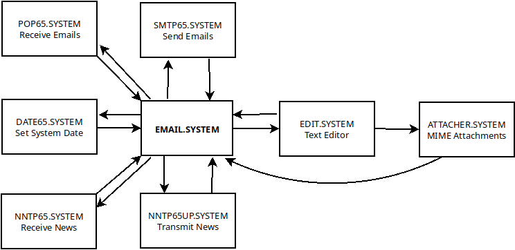

# Apple II Email and Usenet News Suite

## Introduction

Emai//er is an email and Usenet news software package for the Apple //e Enhanced or Apple IIgs.  An Uthernet-II ethernet card is required for sending and receiving messages.

## Key Features

 - Friendly user interface.
 - Email reception using POP3 protocol.
 - Email transmission using SMTP protocol.
 - Gateway to allow access to encrypted services such as GMail.
 - Decoding of MIME encoded message bodies and attached files.
 - Composing MIME emails with attached files.
 - Usenet newgroup subscription.
 - Posting of Usenet news articles.
 - Includes a fully-featured full screen text editor for message composition.

## Emai//er Suite

Emai//er is implemented as a number of ProDOS executables, each of which performs one distinct function.  `EMAIL.SYSTEM` provides the main user interface, and invokes the other executables as needed.  `EMAIL.SYSTEM` is automatically reloaded when the helper program completes its function.

 - `EMAIL.SYSTEM` is a simple user interface for reading and managing email.
 - `EDIT.SYSTEM` is a full screen editor, used for composing email and news messages. It may also be used as a general purpose ProDOS text file editor.
 - `POP65.SYSTEM` is a Post Office Protocol version 3 (POP3) client for the Apple II with Uthernet-II card.  This is used to retrieving incoming email messages.
 - `SMTP65.SYSTEM` is a Simple Mail Transport Protocol (SMTP) client for the Apple II with Uthernet-II card.  This is used for sending outgoing email messages.
 - `NNTP65.SYSTEM` is a Network News Transport Protocol (NNTP) client for the Apple II with Uthernet-II card.  This is used to retrieving Usenet news messages.
 - `NNTP65UP.SYSTEM` is a Network News Transport Protocol (NNTP) client for the Apple II with Uthernet-II card.  This is used for transmitting outgoing Usenet news messages.
 - `ATTACHER.SYSTEM` is used for creating multi-part MIME messages with attached files.
 - `REBUILD.SYSTEM` is a utility for rebuilding mailbox databases, should they become corrupted.  This can also be used for bulk import of messages.
 - `DATE65.SYSTEM` is a Network Time Protocol (NTP) client which can be used for setting the system time and date if you do not have a real time clock.

The following diagram shows the various executables that form the emai//er suite and how they execute one another.  Note how `EMAIL.SYSTEM` serves as the hub from which all the other programs may be invoked.

## Overview

The software has been designed to be modular, which allows new protocols to be added later for handling incoming and outgoing mail.  POP3 was selected as the email download/ingest protocol because it is simple and there are many available server implementations.  SMTP was chosen as the outgoing protocol due to its almost universal adoption for this purpose.  Once again, there are many server-side implementations to choose from.

A few design principles that I have tried to apply:

  - *Simplicity* This software runs on the Apple //e enhanced with 128KB of total system memory. It is important that it be as simple and small as possible. The code is written in C using cc65, which allows more rapid evolution when compared to writing in assembly language, at the expense of larger code which uses more memory.
  - *Modularity* Where it makes sense to split the functionality into separate modules it makes sense to do so in order to make the best use of available memory.
  - *Speed* The software should make the most of the limited hardware of the Apple //e in order to allow speedy browsing of emails without needing much processor or disk activity.
  - *Avoidance of Limits* I tried to avoid the imposition of arbitrary limits to message length or the number of messages in a folder.
  - *Veracity* The software should never modify or discard information. Incoming emails are saved to disk verbatim, including all headers. The system hides the headers when displaying the emails, but they are available for inspection or further processing. The only change that is made to incoming messages is to convert the CR+LF line endings to Apple II CR-only line endings.

## Acknowledgment

`POP65.SYSTEM` and `SMTP65.SYSTEM` are based on Oliver Schmitd's excellent IP65 TCP/IP framework (in particular they follow the design of `WGET65.SYSTEM`.)  Without IP65, this software would not have been possible.

## System Requirements

The minimum system requirements are as follows:

 - Apple //e Enhanced or Apple IIgs computer (ROM01 and ROM03 supported)
 - Uthernet-II ethernet card
 - Mass storage device such as CFFA3000, MicroDrive/Turbo or BOOTI

A CPU accelerator is recommended if you plan to handle large volumes of email or Usenet messages.

emai//er has been extensively tested using ProDOS 2.4.2. However, it should not be a problem to run it under other versions of ProDOS.

## Transport Level Security (TLS)

One problem faced by any retrocomputing project of this type is that Transport Layer Security (TLS) is endemic on today's Internet.  While this is great for security, the encryption algorithms are not feasible to implement on a 6502-based system.  In order to bridge the plain text world of the Apple II to today's encrypted Internet, I have set up a Raspberry Pi using several common open source packages as a gateway.

The Raspberry Pi uses Fetchmail to download messages from Gmail's servers using the IMAPS protocol (with TLS) and hands them off to Postfix, which is used at the system mailer (MTA) on the Pi.  I use Dovecot as a POP3 server to offer a plain text connection to the `POP65.SYSTEM` application on the Apple II.  For outgoing messages, I configured Postfix to accept plain text SMTP connections from `SMTP65.SYSTEM` on the Apple II and to relay the messages to Gmail's servers using secure SMTPS.  

  - [The configuration of the Raspberry Pi is described here.](README-gmail-gateway.md)

## Mailboxes

Each mailbox consists of the following:

 - A directory under the email root, and within this directory
 - Email messages are stored on per file, in plain Apple II text files (with CR line endings) named `EMAIL.nn` where `nn` is an integer value
 - A text file called `NEXT.EMAIL`.  This file initially contains the number 1.  It is used when naming the individual `EMAIL.nn` files, and is incremented by one each time.  If messages are added to a mailbox and nothing is ever deleted they will be sequentially numbered `EMAIL.1`, `EMAIL.2`, etc.
 - A binary file called `EMAIL.DB`.  This file contains essential information about each email message in a quickly accessed format.  This allows the user interface to show the email summary without having to open and read each individual email file.  This file is initially empty and a fixed size record is added for each email message.

The easiest way to create additional mailboxes is using the `N)ew` command in `EMAIL.SYSTEM`.

`POP65.SYSTEM` knows how to initialize `INBOX` but the directory must have been created first.

Note that `SPOOL` is not a mailbox, just a directory. `OUTBOX` is also not a 'proper' mailbox - it has `NEXT.EMAIL` but not `EMAIL.DB`.

If the `EMAIL.DB` file for a mailbox gets corrupted, it will no longer possible to browse the summary and read the messages in `EMAIL.SYSTEM`.  The utility `REBUILD.SYSTEM` can be used to rebuild the `EMAIL.DB` and `NEXT.EMAIL` files for an existing mailbox (see below.)

## Detailed Documentation for Email Functions

Please refer to the linked documents for detailed instructions on how to configure emai//er as an email client.

 - [Initial Setup and Configuration](README-emailler-setup.md)
 - [Main Emai//er user interface `EMAIL.SYSTEM`](README-email.md)
 - [Setting System Date and Time with `DATE65.SYSTEM`](README-date65.md)
 - [Text Editor `EDIT.SYSTEM`](README-edit.md)
 - [Attaching Files with `ATTACHER.SYSTEM`](README-attacher.md)
 - [Receiving Email with `POP65.SYSTEM`](README-pop65.md)
 - [Sending Email with `SMTP65.SYSTEM`](README-smtp65.md)
 - [Rebuilding Mailboxes with `REBUILD.SYSTEM`](README-rebuild.md)

## Detailed Documentation for Usenet Functions

Emai//er supports receiving and sending of Usenet news articles. It has been tested extensively using the Eternal September NNTP server.  Usenet newsgroups are mapped to mailboxes within `EMAIL.SYSTEM`.  A new mailbox is created for each subscribed newsgroup.

Please refer to the linked documents for information about the Usenet functionality in emai//er.

 - [Initial Setup and Configuration](README-usenet-setup.md)
 - [Subscribing to a Newsgroup](README-usenet-subscribe.md)
 - [Receiving News with `NNTP65.SYSTEM`](README-nntp65.system)
 - [Publishing News with `NNTP65UP.SYSTEM`](README-nntp65up.system)

