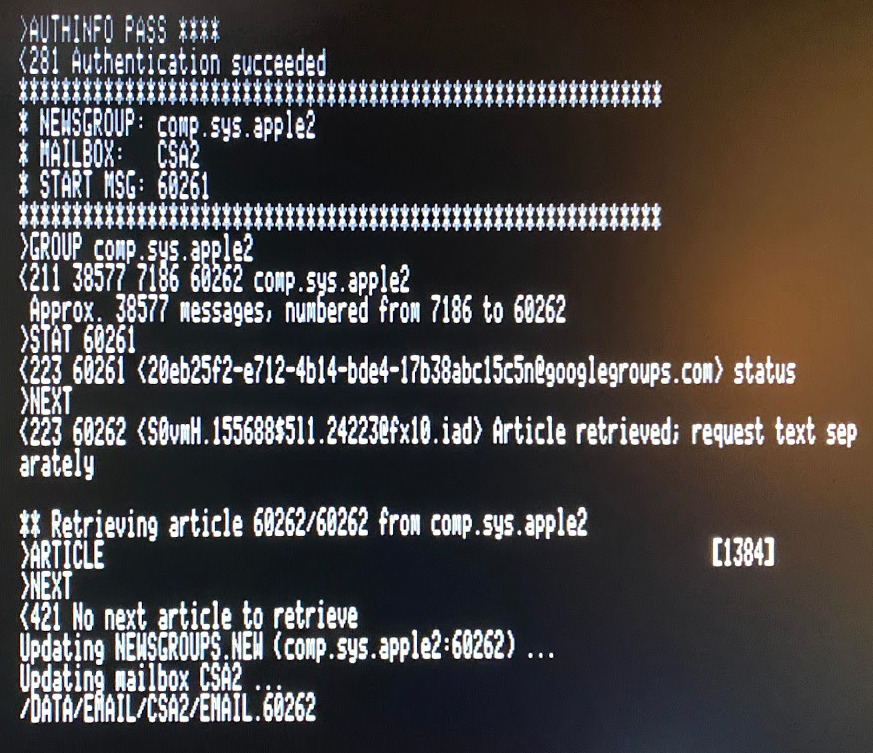
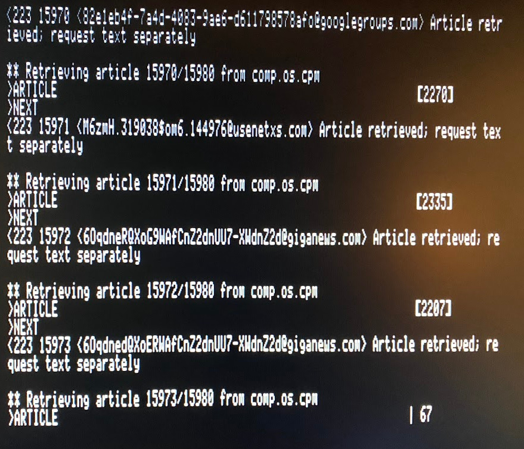

# Apple II Email and Usenet News Suite

[Back to Main emai//er Docs](README-emailler.md#detailed-documentation-for-usenet-functions)

## `NNTP65.SYSTEM`

*Run using `Closed Apple`-`R` in `EMAIL.SYSTEM`*

`NNTP65.SYSTEM` is a Network News Transport Protocol (NNTP) client for the Apple II. It requires an Uthernet-II ethernet card and will not work with other interfaces without modification, because it uses the W5100 hardware TCP/IP stack.

Before running `NNTP65.SYSTEM` for the first time, be sure you have performed the basic Emai//er setup described [here](README-emailler-setup.md) and have also performed the initialization specific to Usenet discussed in [this page](README-usenet-setup.md).  In particular, the `NEWS.SPOOL` directory must have been created, otherwise `NNTP65.SYSTEM` will be unable to download news articles.

`NNTP65.SYSTEM` runs without any user interaction and performs the following tasks:

 - Detect Uthernet-II
 - Obtain IP address using DHCP
 - Connect to NNTP server using parameters from first three lines of `NEWS.CFG`. (`AUTHINFO USER` and `AUTHINFO PASS` commands)
 - For each newsgroup listed in `NEWSGROUPS.CFG`:
   - Issue `GROUP` command to select the newsgroup.
   - Parse the respond from the server which indicates the message number of the first and last messages available in the newsgroup. 
   - If the article number in `NEWSGROUPS.CFG` is zero, set the current article number to the last available article number minus 100 (so that up to 100 articles are retrieved when the newgroup is retrieved for the first time.) Otherwise, set the current article number to the first article number recorded in `NEWSGROUPS.CFG`.
   - Issue the `STAT` command to the NNTP server for the current article number.
   - If the article does not exist, increment the current article number and loop to the previous step.
   - For each article to be retrieved from the selected newsgroup:
     - Issue the `NEXT` command to the NNTP server to advance to the next article.
     - Issue to `ARTICLE` command to retrieve the news article, writing it to a file in the `NEWS.SPOOL` directory (eg: `/H1/DOCUMENTS/EMAIL/NEWS.SPOOL/NEWS.1234`).
   - Write an updated newsgroup line to the file `NEWSGROUPS.NEW`. This will be identical to the line read from `NEWSGROUPS.CFG` except with the last article number updated.
   - Copy the messages just retrieved from the `NEWS.SPOOL` directory to the mailbox for the newsgroup in question.
 - Once all newsgroups have been retrieved, rename `NEWSGROUPS.NEW` to replace `NEWSGROUPS.CFG`.
 - Issue the `QUIT` command to disconnect from the NNTP server.

[Back to Main emai//er Docs](README-emailler.md#detailed-documentation-for-usenet-functions)

